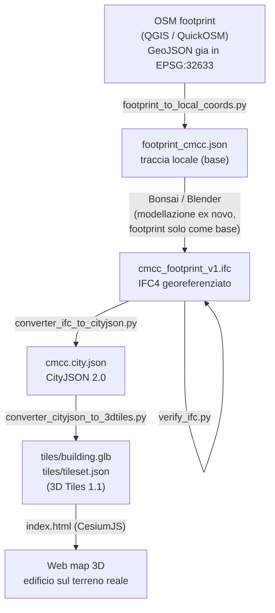

# Da GIS a BIM a Web Map — la catena completa IFC → CityJSON → 3D Tiles → CesiumJS

Prima costruzione **end-to-end** dell'intera pipeline: si parte dal footprint di un
edificio preso dal GIS (OpenStreetMap via QGIS), usato **solo come base**, sopra al
quale il modello BIM è stato disegnato **ex novo** in Bonsai/Blender (nessuna
estrusione automatica). Da lì lo si trasforma passo per passo fino a vederlo nella
posizione reale su una web map 3D (CesiumJS).

Edificio di prova: sede **CMCC di Caserta** (~14.358° E, ~41.049° N, UTM 33N / EPSG:32633).

> ⚠️ **Codice AI-generato, primo giro funzionante.** I due converter (`converter_ifc_to_cityjson.py`,
> `converter_cityjson_to_3dtiles.py`) sono stati scritti con Claude e validati con strumenti
> ufficiali (vedi §Validazione), ma restano una prima passata: gli header degli stessi file
> elencano cosa NON fanno ancora e meritano una review umana prima di essere usati come
> componenti di una pipeline vera.

---

## La catena in un colpo d'occhio



Ogni passaggio è lo stesso problema fisico visto da tre formati diversi: **coordinate
grandi (reali) fuori, coordinate piccole (locali) dentro, e una trasformazione che le
lega.** È il filo conduttore che ricorre in `IfcMapConversion`, nel `transform` del
CityJSON e nel `transform` del tileset 3D Tiles.

---

## Struttura della cartella

```
from_gis_to_bim_to_webmap/
├── data/
│   ├── footprint_cmcc.geojson      # footprint OSM esportato da QGIS (EPSG:32633)
│   ├── footprint_cmcc.json         # footprint in coord. locali + origine UTM (output stage 1)
│   ├── cmcc_footprint_v1.ifc       # modello BIM georeferenziato (IFC4, da Bonsai)
│   └── cmcc.city.json              # CityJSON 2.0 (output stage 3)
├── scripts/
│   ├── footprint_to_local_coords.py    # stage 1: GIS → coordinate locali
│   ├── verify_ifc.py                   # controllo: legge CRS + MapConversion dall'IFC
│   ├── converter_ifc_to_cityjson.py    # stage 3: IFC → CityJSON
│   └── converter_cityjson_to_3dtiles.py# stage 4: CityJSON → 3D Tiles
└── tiles/
    ├── building.glb                # geometria in coordinate locali ECEF (output stage 4)
    └── tileset.json                # transform ECEF + bounding volume (output stage 4)
```

La web map (`../index.html`) sta un livello sopra, in `cesium_learning/`, e punta a
`from_gis_to_bim_to_webmap/tiles/tileset.json`.

---

## I passaggi, uno per uno

### Stage 1 — GIS → coordinate locali (`scripts/footprint_to_local_coords.py`)

Gira **dentro la Console Python di QGIS**, con il layer del footprint OSM attivo.
Legge il primo poligono, chiude il ring, sottrae l'angolo in basso a sinistra come
origine e produce vertici locali in metri. Output: `data/footprint_cmcc.json`
(origine UTM + vertici locali + un'altezza `height_m` stimata da misurare).

Il footprint è stato preso da OSM con QuickOSM (`elementId 877880557`) ed esportato
anche come `data/footprint_cmcc.geojson`.

> ✅ **Coordinate già esatte alla fonte.** Il GeoJSON esportato da QGIS dichiarava già
> il CRS corretto (`urn:ogc:def:crs:EPSG::32633`, cioè UTM 33N): le coordinate erano
> quindi già giuste, senza alcuna assunzione o riproiezione. È il caso opposto
> dell'esempio `twobuildings` nel README principale, che non dichiarava alcun CRS e ha
> richiesto un EPSG *assunto*.

### Stage 2 — footprint come base → IFC disegnato ex novo (Bonsai / Blender, **manuale**)

Passaggio non scriptato e **senza estrusione automatica**: in Blender con l'estensione
**Bonsai** il modello BIM è stato disegnato **ex novo**, usando il footprint solo come
**base/traccia** a terra. Si imposta poi la georeferenziazione (`IfcProjectedCRS` +
`IfcMapConversion`). Risultato: `data/cmcc_footprint_v1.ifc` (schema IFC4, unità in metri).

`scripts/verify_ifc.py` è il controllo di sanità: rilegge dall'IFC il `IfcProjectedCRS`
e il `IfcMapConversion` (Eastings/Northings/Height) per confermare che la
georeferenziazione ci sia davvero prima di andare avanti.

### Stage 3 — IFC → CityJSON (`scripts/converter_ifc_to_cityjson.py`)

Il cuore geometrico. In sintesi:

1. legge il fattore di scala dell'unità di lunghezza da `IfcUnitAssignment` (mai
   assumere i metri);
2. legge rotazione + traslazione da `IfcMapConversion` → coordinate CRS reali;
3. tassella ogni `IfcProduct` con `ifcopenshell.geom` (`USE_WORLD_COORDS=True`);
4. de-duplica i vertici in una lista globale (CityJSON condivide gli indici);
5. quantizza i float in interi tramite il `transform` (scale + translate).

Output: `data/cmcc.city.json` (CityJSON 2.0).

> 🐛 **Lezione dal bug v1→v2** (annotata nell'header dello script): un attributo a
> *lista* (`ifcGlobalId` come array di 14 stringhe) faceva sì che i loader CityJSON di
> QGIS caricassero il file "con successo" ma **senza produrre alcun layer**, in silenzio.
> "CityJSON valido" e "caricabile in un GIS tabellare" non sono la stessa cosa: gli
> attributi ora sono scalari (liste unite con `;`).

### Stage 4 — CityJSON → 3D Tiles (`scripts/converter_cityjson_to_3dtiles.py`)

Scrive `tiles/building.glb` + `tiles/tileset.json` senza tiler esterni:

1. de-quantizza i vertici CityJSON → coordinate UTM reali;
2. UTM → ECEF (EPSG:4978) con `pyproj`;
3. sottrae il centroide ECEF → coordinate locali piccole (sicure in float32);
4. ruota Z-up → Y-up (compensando la conversione che Cesium applica al caricamento);
5. scrive un GLB minimo valido;
6. scrive `tileset.json` con `transform` = traslazione al centroide ECEF.

> 💡 **Perché non `cjio export glb`?** Perché scrive i vertici in UTM assoluto (~4,5
> milioni di metri): in float32 sulla GPU si perde ~mezzo metro di precisione → jitter.
> 3D Tiles vuole **vertici piccoli locali** + i numeri grandi nel `transform` del
> tileset (letto una volta, in float64).

### Stage 5 — Web map (`../index.html`, CesiumJS)

Carica il tileset e inquadra l'edificio. Punti chiave nei commenti del file:

- **Offset verticale di +100 m** (workaround): l'IFC ha `OrthogonalHeight=0`, ma il
  terreno a Caserta è a ~100 m di quota **ellissoidica**. Il fix definitivo è scrivere
  la quota ellissoidica corretta in `IfcMapConversion.OrthogonalHeight` alla fonte
  (Bonsai) e rigenerare. Promemoria: una quota va sempre dichiarata *rispetto a cosa*
  (ellissoide WGS84 vs livello del mare).
- Il layer globale **Cesium OSM Buildings** è disattivato di proposito, per vedere solo
  il nostro edificio (l'OSM ne ha una versione con `estimatedHeight=3`).

---

## Come eseguirla

### Prerequisiti

```bash
# dalla root del repo
python -m venv venv-ifc
venv-ifc\Scripts\Activate.ps1        # Windows PowerShell
# source venv-ifc/bin/activate       # macOS / Linux

pip install -r requirements.txt      # ifcopenshell, cjio, trimesh, numpy...
pip install pyproj                    # richiesto dallo stage 4
```

Serve inoltre **QGIS** (stage 1) e **Blender + Bonsai** (stage 2) come strumenti desktop.

### Sequenza

```bash
# stage 1: eseguire DENTRO la Console Python di QGIS, col footprint attivo
#          (produce data/footprint_cmcc.json)

# stage 2: manuale in Bonsai/Blender (produce data/cmcc_footprint_v1.ifc)

# stage 3 e 4: da terminale, col venv attivo
python scripts/verify_ifc.py                    # controllo georeferenziazione
python scripts/converter_ifc_to_cityjson.py     # → data/cmcc.city.json
python scripts/converter_cityjson_to_3dtiles.py # → tiles/building.glb + tileset.json
```

### Vedere la web map

1. In `cesium_learning/index.html` incollare il proprio **token Cesium ion**
   (gratuito su <https://ion.cesium.com/tokens>) al posto di `YOUR_CESIUM_ION_TOKEN`.
2. Servire la cartella `cesium_learning/` via HTTP (i moduli ES e i `fetch` del
   tileset non funzionano da `file://`):
   ```bash
   cd cesium_learning
   python -m http.server 8080
   ```
3. Aprire <http://localhost:8080/> → l'edificio compare sul terreno reale di Caserta.

---

## Validazione

Gli output sono stati verificati con strumenti indipendenti e ufficiali:

| Output | Strumento | Esito |
|---|---|---|
| `cmcc.city.json` | [ninja.cityjson.org](https://ninja.cityjson.org/), `cjval` (schema), `val3dity` (ISO 19107) | ok + check visivo in QGIS |
| `building.glb` | Khronos glTF Validator | 0 errori |
| `tileset.json` | CesiumGS `3d-tiles-validator` | 0 errori |

---

## Limiti noti / TODO

- **Path assoluti hardcoded.** I converter degli stage 3–4 hanno i path
  `D:\CMCC_REGEN4BE\...` in testa al file: chi clona il repo deve adattarli. È il
  record del primo giro funzionante, non ancora un tool portabile.
- **`OrthogonalHeight=0`** nell'IFC → offset verticale di +100 m nella web map come
  workaround (vedi Stage 5). Fix alla fonte in Bonsai.
- **Un solo edificio, un solo tile**, nessun LOD/gerarchia, nessuna estensione
  metadati/picking (`EXT_mesh_features`), fan di triangoli naïf per facce non triangolari.
- **Nessuna classificazione semantica** delle superfici (Wall/Roof/GroundSurface):
  tutto collassa in un unico "Building".
- **Token Cesium** da non committare: nel repo è un placeholder.

---

## Riferimenti

- CityJSON: <https://www.cityjson.org/> · ninja viewer: <https://ninja.cityjson.org/>
- 3D Tiles 1.1 (OGC / CesiumGS): <https://github.com/CesiumGS/3d-tiles>
- CesiumJS: <https://cesium.com/platform/cesiumjs/>
- IfcOpenShell: <https://docs.ifcopenshell.org/> · Bonsai: <https://bonsaibim.org/>
- Sull'impedance mismatch CityJSON→QGIS: Vitalis et al. (2020)
